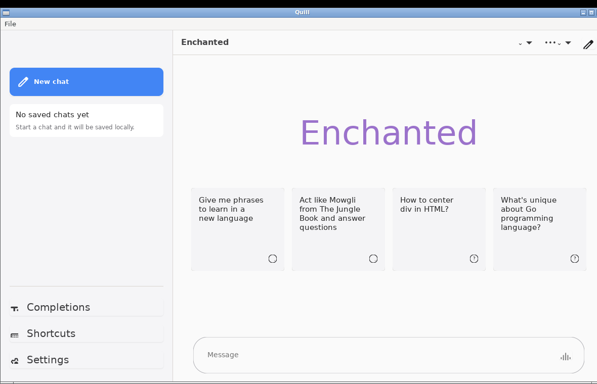

# QuillUI



QuillUI is an open-source compatibility layer for Apple Swift app source on
Linux desktops.

The public goal is **Apple Swift app compatibility with macOS-quality Linux
rendering**: rebuild SwiftUI/AppKit/SwiftData-shaped source for Linux, preserve
the app's familiar interaction model, and map platform services explicitly.
QuillUI is not an Apple platform clone, emulator, binary compatibility layer, or
replacement for Apple's frameworks on Apple platforms.

## Start Here

- **Porting a new upstream app to Linux? Read this first:** [docs/porting-upstream-apps.md](docs/porting-upstream-apps.md) — the field guide for *converting* real Apple/iOS app source (Enchanted, WireGuard, NetNewsWire, Ice Cubes, …): the iOS platform-pin myth, vendor-vs-reimpl strategy, the shim recipe, the Linux `FoundationNetworking` split, the qt-native build trap, and wiring real vendored types into the live app.
- **Reimplementing AppKit on Qt — architecture & hard-won lessons:** [docs/appkit-reimplementation.md](docs/appkit-reimplementation.md) is the orientation doc for running real macOS/AppKit apps on Linux: the strategy (reimplement the framework, apps are conformance tests; source-recompile not binary loading), the Qt mapping, the Objective-C-runtime wall and the source-lowering that gets past it, plus the CI/Docker/Git lessons we already paid for. Read it before working on `QuillAppKit`/`Cocoa`/conformance.
- **Function-by-function Apple package coverage:** [docs/apple-package-function-coverage.md](docs/apple-package-function-coverage.md) is the linked source of truth for complete vs incomplete APIs in each Apple-package compatibility surface and each app target. Start there for SwiftUI, SwiftData, AppKit/UIKit, Network, media/service kits, system kits, third-party package compatibility, and app progress.
- **Network parity pocket:** [Network function rows](docs/apple-package-function-coverage.md#network) list the narrow API rows currently at `Parity`; path monitor initial state, pre-start cancellation, path support/interface helper queries, scoped service endpoint descriptions, associated interface values, `NWError.posix`/`.dns`/`.tls` value text, `NWProtocolTCP.Options`/`NWProtocolUDP.Options` default and setter behavior, `NWProtocolOptions`, `NWParameters.defaultProtocolStack`, `NWParameters.ProtocolStack`, `NWProtocolIP.Options`, IP option enum value surfaces, and `NWParameters` policy enum/default/setter/debug text are now pinned there, while broader transport, DNS, TLS, connection, listener, VPN, live monitoring, and IP packet/socket effects are still incomplete.
- **Security and Signal key-material coverage:** [Security rows](docs/apple-package-function-coverage.md#security), [KeychainSwift rows](docs/apple-package-function-coverage.md#keychainswift), and [Signal app progress](docs/apple-package-function-coverage.md#app-progress-summary) track `SecKey`, `SecItem`, `KeychainSwift`, and Signal/libsignal-facing compatibility, including which rows are deterministic source-compatibility shims versus production-grade crypto.
- **SceneKit conformance:** [docs/scenekit-conformance.md](docs/scenekit-conformance.md) tracks the 3D compatibility lane. Rungs 1-6 are complete: Euclid and ShapeScript compile, the SwiftUI SceneKit fixtures compile and render, Euclid mesh interop renders, ShapeScriptViewer launch-smokes, hit-testing and live camera controls work, and Apple SceneKit software-renderer golden envelopes are source/smoke-gated.
- **App progress:** [App progress summary](docs/apple-package-function-coverage.md#app-progress-summary) and [docs/app-targets.md](docs/app-targets.md) track target-by-target status.
- **Enchanted on Linux (real upstream source):** [docs/enchanted-linux-port.md](docs/enchanted-linux-port.md) — architecture, the lowering/rewrite-rule compat layer, QuillData + SwiftOpenUI runtime gotchas, the Docker functional-test harness, debugging meta-lessons, the reimpl-retirement playbook, and known open issues. **Read this before working on the Enchanted port.**
- **Repository boundaries:** [docs/repository-boundaries.md](docs/repository-boundaries.md) separates reusable Quill libraries, app ports, upstream/vendor material, generated profiles, and agent infrastructure.
- **Enchanted release plan:** [docs/enchanted-release-plan.md](docs/enchanted-release-plan.md) is the current shipping plan. Enchanted is the first polished app; the other app ports are conformance targets until that release is credible.

The Linux runtime and build graph are selected separately. `QUILLUI_BACKEND`
requests `gtk` or `qt` at launch for backend smoke/profile parity. App products
use canonical executable names on Linux; the SwiftPM manifest-time selector
`QUILLUI_LINUX_BACKEND=gtk|qt` chooses whether those products compile against
GTK or Qt dependencies. Qt builds require Qt6 Widgets and never load the GTK
graph.

`QuillChatKit` is a reusable SwiftUI chat chrome library product for Signal,
Telegram, and native SwiftUI clients on macOS/iOS. Its native SwiftUI boundary
is checked with `scripts/check-quillchatkit-ios.sh`, which builds the library
against the iOS simulator SDK at the package's iOS 14 floor. The default
`ChatAppearance.standard` tokens preserve the desktop app chrome, while
`ChatAppearance.touch` and `ChatAppearance.platformDefault` provide touch-first
density profiles for iOS clients without a UIKit or QuillUI dependency.
`ChatSplitShell` is available on iOS 16+ / macOS 13+ for apps that want the
same split-view chat routing used by the Linux Signal and Telegram targets.

Current release focus:

1. `quill-chat-linux` - the generated Linux build of the real upstream
   Enchanted / Quill Chat source.

Current backend parity conformance targets:

1. `quill-wireguard`
2. `quill-netnewswire`
3. `quill-icecubes`
4. `quill-codeedit`
5. `quill-signal`
6. `quill-telegram`
7. `quill-iina`

The hand-written Enchanted reimpl targets (`quill-enchanted`,
`quill-enchanted-upstream-slice`) were retired (epic #188); the real upstream
Enchanted now runs as the generated `quill-chat-linux` app (see below and
[docs/enchanted-linux-port.md](docs/enchanted-linux-port.md)).

Generated external app coverage also includes `quill-chat-linux` when the
local Quill Chat checkout is available.

## Apple Package Function Coverage

The [Apple package function coverage ledger](docs/apple-package-function-coverage.md)
is the source of truth for function-by-function complete/incomplete status
across SwiftUI, SwiftData, AppKit/UIKit, Network, media/service kits, system
kits, third-party package compatibility, and app progress. Rows marked `Parity` are
the only rows treated as full Apple/Linux contract matches.

Function coverage index:

- [Network](docs/apple-package-function-coverage.md#network): the current first
  parity pocket, including path monitor initial/pre-start-cancel state,
  path/interface value semantics, endpoint/host/address/port value behavior,
  `NWError` constructor/equality/debug/localized text behavior,
  `NWProtocolOptions`, `NWParameters.defaultProtocolStack`,
  `NWParameters.ProtocolStack`, `NWProtocolIP.Options`, IP option enum value
  surfaces, `NWParameters` factory/initializer text plus
  policy enum/default/setter/debug behavior, and Apple-checked
  protocol-surface conformance rows.
- [SwiftUI](docs/apple-package-function-coverage.md#swiftui),
  [SwiftData](docs/apple-package-function-coverage.md#swiftdata),
  [AppKit](docs/apple-package-function-coverage.md#appkit), and
  [UIKit](docs/apple-package-function-coverage.md#uikit): primary Apple UI and
  model package compatibility ledgers.
- [SceneKit conformance](docs/scenekit-conformance.md): rung-based 3D
  compatibility coverage for the SceneKit shim, CoreGraphics geometry support,
  Euclid mesh interop, ShapeScriptViewer, software rendering, hit-testing,
  camera controls, GTK/AppKit event delivery, and Apple golden envelopes.
- [WebKit](docs/apple-package-function-coverage.md#webkit),
  [AuthenticationServices](docs/apple-package-function-coverage.md#authenticationservices),
  [UniformTypeIdentifiers](docs/apple-package-function-coverage.md#uniformtypeidentifiers),
  [NetworkExtension](docs/apple-package-function-coverage.md#networkextension),
  [AVFoundation](docs/apple-package-function-coverage.md#avfoundation),
  [AVKit](docs/apple-package-function-coverage.md#avkit),
  [Speech](docs/apple-package-function-coverage.md#speech),
  [PhotosUI and Photos](docs/apple-package-function-coverage.md#photosui-and-photos),
  [Charts](docs/apple-package-function-coverage.md#charts),
  [StoreKit](docs/apple-package-function-coverage.md#storekit), and
  [TipKit](docs/apple-package-function-coverage.md#tipkit): web, network
  extension, media, and service kit ledgers.
- [CoreGraphics](docs/apple-package-function-coverage.md#coregraphics),
  [Security](docs/apple-package-function-coverage.md#security),
  [Observation](docs/apple-package-function-coverage.md#observation),
  [ApplicationServices](docs/apple-package-function-coverage.md#applicationservices),
  [ServiceManagement](docs/apple-package-function-coverage.md#servicemanagement),
  [AsyncAlgorithms](docs/apple-package-function-coverage.md#asyncalgorithms),
  [Carbon](docs/apple-package-function-coverage.md#carbon),
  [Combine](docs/apple-package-function-coverage.md#combine),
  [os](docs/apple-package-function-coverage.md#os), and
  [IOKit](docs/apple-package-function-coverage.md#iokit): system and support
  package compatibility ledgers.
- [Re-export-only Apple shims](docs/apple-package-function-coverage.md#re-export-only-apple-shims),
  [third-party and app-support package compatibility](docs/apple-package-function-coverage.md#third-party-and-app-support-package-clones),
  and [app progress](docs/apple-package-function-coverage.md#app-progress-summary):
  compatibility-only shims, package compatibility progress, and app target status.

- [Network function coverage](docs/apple-package-function-coverage.md#network): current
  Network rows that have reached Apple/Linux parity. The path monitor initial
  state and pre-start cancellation rows, path/interface enum rows, and scoped-interface value rows are pinned by
  `NetworkPathInterfaceParityTests` for string, name/type, equality, and hash
  semantics; the address rows are backed by Apple-observed
  IPv4/IPv6 parser, data initializer, classifier-boundary, multicast-scope,
  IPv4 mapping, string, debug-output, equality, and hash tests, including
  `IPv4Address.init?(String)` legacy single-value wrapping and dotted-field
  octal/hex edge cases; the endpoint rows cover scoped and unscoped host parsing,
  direct-value equality/hash coherence, port
  parser/constant/equality/hash semantics, host-port/service/Unix endpoint
  value behavior including scoped service interface suffixes, and
  `NWError.posix`, `.dns`, and `.tls` equality, Sendable, debug text, Apple
  localized error formatting, and common Darwin POSIX network failure payloads;
  TCP/UDP protocol option defaults and setters; and
  `NWParameters` policy enums, defaults, setter normalization, local endpoint
  debug formatting, and traffic, multipath, proxy, and DNSSEC debug segments are
  pinned by shared Apple/Linux tests.
- [API coverage matrix](docs/api-coverage-matrix.md): backend and app-facing API evidence.
- [App targets](docs/app-targets.md): target-by-target app progress.

## Coverage Ledgers

- [Apple package function coverage](docs/apple-package-function-coverage.md): direct function-by-function coverage ledger.
- [API coverage matrix](docs/api-coverage-matrix.md): backend and app-facing API evidence.
- [App targets](docs/app-targets.md): target-by-target app progress.

## Compatibility Progress

Status terms:

- `Apple-native`: QuillUI defers to the real Apple framework on Apple platforms.
- `Parity`: the same app/API source compiles and runs on Apple and Linux, with shared contract, golden, and seeded fuzz tests proving equivalent user-facing outputs except for explicitly documented platform differences.
- `Usable`: covered by source or smoke tests and exercised by at least one app target.
- `Partial`: enough API shape exists for current app ports, but framework behavior is incomplete.
- `Compile shim`: imports, types, and selected calls compile, with little or no runtime behavior.
- `Fallback`: the API intentionally degrades and usually records compatibility diagnostics.

Progress is intentionally conservative. `Compatible today` means either real
Linux runtime behavior exists or enough metadata is preserved for the GTK/Qt
backends and source-contract tests to prove the app-facing API shape. The
detailed evidence lives in [docs/api-coverage-matrix.md](docs/api-coverage-matrix.md),
[docs/apple-package-function-coverage.md](docs/apple-package-function-coverage.md),
and [docs/app-targets.md](docs/app-targets.md); this README is the high-level
checklist.

### Function-Level Compatibility Ledger

The function-by-function Apple package and app-facing package compatibility status lives
in [docs/apple-package-function-coverage.md](docs/apple-package-function-coverage.md).
That ledger is the source of truth for per-function `Parity`, `Usable`, and
incomplete rows across Apple compatibility packages such as `Network` and `Security`.
In that ledger, `Usable` and `Parity` rows are complete for today's tested
Linux contract. `Partial`, `Fallback`, `Compile-only`, and `Incomplete` rows
are intentionally listed as incomplete until the missing Apple or upstream
package behavior is implemented and covered by source-contract, golden, or
seeded fuzz tests.

| Apple package area | Complete today | Incomplete today |
| --- | --- | --- |
| `SwiftUI` compatibility layer | Focused rows such as `Font.Weight`. | Most app-facing view and modifier metadata is still partial; full layout, diffing, animation, transition, gesture, accessibility, focus, scene, and rendering parity remains open. |
| `SwiftData` / `QuillData` | Table mapping, inserts, deletes, saves, deterministic error text, and current Enchanted persistence flows. | Full Apple SwiftData schema, relationship, predicate, migration, CloudKit, undo, observation, and concurrency semantics. |
| `AppKit` / `QuillAppKit` | In-memory undo, view hierarchy, window geometry, pasteboard, menu, pop-up, stack, progress, child-controller, selected workspace/document flows, and GTK-hosted `NSView` cursor/click/drag/scroll delivery for custom views. | Native event loop, Auto Layout, full CALayer/drawing parity, accessibility, file dialogs, global cursor/event taps, XPC, sharing, audio, host font metrics, and full window-manager behavior. |
| `UIKit` / `QuillUIKit` | `UIApplication.shared` and selected source-compatible aliases and in-memory bridges. | Mobile renderer, lifecycle, layout engine, navigation, presentation, text input, events, accessibility, haptics, notifications, and collection/table parity. |
| `SceneKit` 3D compatibility | Scene graph types, node traversal/replacement/cloning helpers, node local/world transforms, scale, orientation, direction vectors, presentation, node bounding boxes, materials, geometry sources/elements, parametric primitives, Euclid mesh interop, SwiftUI `SceneView`, `SCNView`, deterministic software rendering, per-pixel z-buffered intersecting geometry, material depth flags, `renderingOrder`, hit-testing, camera orientation/controls, explicit `SCNCamera.zNear`/`zFar` culling, deterministic primitive/repeating `SCNAction` stepping with completion handlers, Quill scene archive write/reload, GTK/AppKit event delivery, and Apple golden-envelope smoke rows are complete for the current conformance lane. | Full GPU SceneKit parity, external asset import/export fidelity, advanced lighting/shading, full animation system parity, transparent material sorting, physics, particles, constraints, skeletal animation, and broad material/texture fidelity remain incomplete. |
| Web, network, media, and service Apple kits | Selected compile or fallback shapes for `WebKit`, `AuthenticationServices`, `Network`, `NetworkExtension`, `AVFoundation`, `Speech`, `PhotosUI`, `Charts`, `StoreKit`, and `TipKit`; `Network` address parsing, address constants, address classifier properties, scoped IPv4/IPv6/name host interface literals, port parsing with seeded fuzz coverage, port equality/hash semantics, well-known port constants, path monitor initial and pre-start cancel state, path status/reason/type string/equality/hash semantics, endpoint-host classification/equality/hash including scoped parsed-to-direct values, `NWEndpoint` host-port/service/Unix path description/debug/equality/hash value APIs, `NWError.posix`/`.dns`/`.tls` constructor/equality/debug/localized text, and `NWParameters` plus TCP/UDP/TLS option constructor, protocol-stack/IP option value surfaces, policy enum/default/setter, and debug text now have Apple-checked parity rows. | Real web rendering, authentication sessions, DNS/TLS/TCP/UDP behavior, IP packet/socket option effects, VPN tunnels, media I/O, speech, photo library, chart rendering, purchases, and tip persistence. |
| System and support kits | Focused usable rows for `ServiceManagement`, `Security` `SecRandomCopyBytes`, process-local `Security` `SecItem` generic-password, internet-password, and key-class add/copy/update/delete storage with persistent-reference handles, access-group namespace filters, synchronizable filters, `kSecAttrSynchronizableAny` matching, access-control metadata, authentication/use query controls, internet endpoint identity fields, key-item application-tag/application-label/key-class/key-type/key-size/capability metadata, process-local `SecKeyCreateWithData`, `SecKeyCreateRandomKey`, `SecKeyGeneratePair`, `SecKeyCopyPublicKey`, `SecKeyGetBlockSize`, `SecKeyCopyAttributes`, `SecKeyCopyExternalRepresentation`, metadata-gated `SecKeyIsAlgorithmSupported` checks, deterministic ECDSA message/digest `SecKeyCreateSignature` and `SecKeyVerifySignature` compatibility, deterministic symmetric ECDH `SecKeyCopyKeyExchangeResult` compatibility with requested-size/shared-info parameters, and synthesized `SecKey` references for key-class `kSecReturnRef` rows, CoreGraphics geometry/path value behavior, `CGContext` current-path introspection, keyboard-event unicode value storage, font rendering state flags, and Cairo-backed `CGContext` path/dash forwarding, `AsyncAlgorithms`, `AnyPublisher`, and `Logger` initialization. | Full CoreGraphics drawing/event parity, native secure `Security` keychain persistence/access-control enforcement, OS-enforced keychain sharing, real keychain synchronization, native key validation/handles, native cryptographic key generation, cryptographically valid sign/verify, native/cryptographically valid key agreement, Secure Enclave behavior, `Observation`, `ApplicationServices`, `Carbon`, `IOKit`, `os`, and Combine edge-case parity. |
| Re-export-only Apple shims | Imports compile for current app source. | Standalone framework behavior for `MessageUI`, `SafariServices`, `MobileCoreServices`, `LocalAuthentication`, and `CoreSpotlight`. |

### Current Progress Snapshot

| Track | Done now | Still open |
| --- | --- | --- |
| SwiftUI compatibility | App/scene launch, common view declarations, state wrappers, file-import helpers, menu/picker/list extraction, image helpers, compatibility diagnostics, and many modifier metadata paths compile and are tested against current app sources. | Full SwiftUI layout, accessibility, animation, transitions, gesture semantics, focus routing, multi-window scenes, and high-fidelity backend rendering are incomplete. |
| Apple kit compatibility | AppKit, UIKit, SwiftData, Foundation/CoreGraphics/Security, WebKit, Network, media/service frameworks, Combine, `os`, and legacy platform kits expose enough surface for the app targets to compile. Network protocol-stack/IP option value surfaces are now in the Apple-checked Network parity pocket, and `Security` has parity for the valid-count `SecRandomCopyBytes` contract plus a usable process-local `SecItem` generic-password, internet-password, and key-class contract for add/copy/update/delete, persistent-reference handles, access-group namespace filters, synchronizable filters, `kSecAttrSynchronizableAny` matching, access-control metadata, authentication/use query controls, server/protocol/authentication/port/path endpoint identity, key-item application-tag/application-label/key-class/key-type/key-size/capability metadata, imported/generated `SecKey` byte/attribute/block-size round-trips, metadata-gated common ECDSA/ECDH/RSA algorithm-support queries, deterministic ECDSA message/digest `SecKeyCreateSignature` and `SecKeyVerifySignature` compatibility, deterministic symmetric ECDH `SecKeyCopyKeyExchangeResult` compatibility with requested-size/shared-info parameters, process-local `SecKeyCreateRandomKey`/`SecKeyGeneratePair`/`SecKeyCopyPublicKey`, and synthesized key references. | Most kits are scoped app-contract compatibility surfaces, not full framework replacements; real platform services such as native secure keychain persistence/access-control enforcement, OS-enforced keychain sharing, real keychain synchronization, native key validation/handles, native cryptographic key generation, cryptographically valid sign/verify, native/cryptographically valid key agreement, Secure Enclave behavior, VPN tunnels, web rendering, media playback/capture, speech, IP packet/socket option effects, and service management remain limited or fallback-only. |
| SceneKit conformance | Rungs 1-6 are complete. SceneKit now carries a tested scene graph, CoreGraphics-backed geometry support, Euclid/ShapeScript interop, deterministic software rasterization with per-pixel z-buffering, material depth flags, `renderingOrder`, SCNView/SceneView rendering, hit-testing, explicit camera clipping, camera controls, primitive/repeating `SCNAction` stepping with completion handlers, Quill scene archive write/reload, GTK/AppKit pointer/scroll/magnify delivery, and Apple golden-envelope pixel checks. | This is a CPU/software renderer over the existing 2D paint path, not GPU SceneKit. Remaining work includes external asset import/export fidelity, richer transparency sorting, lights/materials/textures, full animation system parity, and broader SceneKit APIs. |
| Third-party package compatibility | Enchanted and chat/editor/feed shells can compile with scoped compatibility surfaces for packages such as `OllamaKit`, `KeychainSwift`, `MarkdownUI`, `Splash`, `ActivityIndicatorView`, `WrappingHStack`, `Vortex`, `KeyboardShortcuts`, `Magnet`, `Sparkle`, and `Alamofire`. Signal-style key-material work now has lower-level `Security` random-byte generation, process-local imported/generated `SecKey` byte/attribute/block-size round-trips, metadata-gated common ECDSA/ECDH/RSA algorithm-support queries, deterministic ECDSA message/digest `SecKeyCreateSignature` and `SecKeyVerifySignature` compatibility, deterministic symmetric ECDH `SecKeyCopyKeyExchangeResult` compatibility with requested-size/shared-info parameters, generated private/public key references via `SecKeyCreateRandomKey`, `SecKeyGeneratePair`, and `SecKeyCopyPublicKey`, synthesized key references, and process-local `SecItem` generic-password, internet-password, and key-class storage surfaces, including access-group/synchronizable namespace filters, `kSecAttrSynchronizableAny` matching, access-control metadata, authentication/use query controls, server/protocol/authentication/port/path endpoint separation, key-item application-tag/application-label/key-class/key-type/key-size/capability metadata, and persistent keychain handle lookup/delete. `KeychainSwift` now follows upstream-shaped UTF-8 `String`, raw `Data`, single-byte `Bool`, `getData(_:asReference:)`, `allKeys`, prefix/access-group/synchronizable, result-code, and namespace `clear()` semantics for current Signal-style account/key storage code. | Package coverage follows the app ports. APIs not exercised by current targets may be missing or fallback-only, and keychain rows/generated keys/signatures/key-exchange data are not secure OS keychain or native crypto replacements yet. |
| App targets | Enchanted, WireGuard, Signal, Telegram, IceCubes, NetNewsWire, CodeEdit, IINA, and optional generated Quill Chat coverage are represented in the backend matrix. Enchanted's genuine-native macOS empty state (new-conversation) is now landmark-gated on the GTK backend at a ≥0.95 parity ratio via `validate_quill_enchanted_empty_state_gtk` (centered gradient wordmark, minimal sidebar with no blue New-chat button, horizontal 4-card prompt row, short composer bar, 3-item bottom nav). | Enchanted is the parity priority. Residual GTK-font nuances remain in the empty state (the action-card bulb glyph renders as an empty circle; the gradient wordmark renders as a near-uniform purple), and in-conversation/settings parity is still in progress. The other ports are mostly shell/core-logic targets until their upstream app behaviors are brought across. |
| Backend parity | GTK and Qt build graphs are isolated and checked independently through shared matrix scripts. | GTK and Qt are both compared against native macOS behavior; neither Linux backend is treated as the reference for the other. |

### API-by-API SwiftUI Compatibility Progress

These rows track the SwiftUI-shaped API families QuillUI currently implements or
adapts. `Compatible today` means app source can compile and the preserved
metadata or runtime behavior is visible to the Linux backends and tests.

| API area | Status | Compatible today | Not compatible yet |
| --- | --- | --- | --- |
| `QuillUI` / `SwiftUI` module boundary | Apple-native on Apple, usable on Linux | Re-exports real SwiftUI on Apple platforms. Linux builds use SwiftOpenUI plus `QuillSwiftUICompatibility`, with `QuillUIGtk` and `QuillUIQt` sharing the same app scene contracts. | Not a complete SwiftUI replacement; compatibility is driven by the app matrix and source-contract tests. |
| App, scene, and backend launch | Usable | Canonical app products launch through `QUILLUI_BACKEND` at runtime and `QUILLUI_LINUX_BACKEND=gtk|qt` at build time. GTK and Qt products are tracked by `scripts/quillui-backend-products.sh app-matrix`. | Only the app/window patterns used by current ports are covered. Advanced SwiftUI scene types and multi-window behavior are still limited. |
| Text, labels, and markdown-shaped content | Partial | Current ports compile common `Text`, `Label`, text-label helpers, MarkdownUI/Splash-shaped code paths, prompt text, selection text, and shell copy affordances. | Rich text editing, full `AttributedString` rendering, bidirectional text, text selection parity, accessibility text metadata, and every Markdown/code-highlighting feature are incomplete. |
| Images, symbols, and rendering | Partial | `Image`, SF-symbol-style names, `Image(data:)`, `PlatformImage`, gdk-pixbuf round trips, `ImageRenderer` color payloads, and system icon contracts are tested. | General view-to-image rendering, full symbol fidelity, animated images, metadata/color-profile preservation, and every bitmap/vector format are incomplete. |
| Layout containers and navigation | Partial | Stacks, lists/sidebars, split-view-shaped shells, navigation routing, toolbar declarations, prompts, and initial selection flows compile for the current apps. | SwiftUI's full layout solver, layout priority, geometry preferences, scroll behavior, navigation stacks/split state restoration, and macOS-exact sidebar metrics need more backend work. |
| Controls, forms, menus, pickers, and dialogs | Partial | `Button`, `Form`, picker option extraction, menu extraction, confirmation dialogs, toolbar items, popovers/sheets via AppKit bridges, and app prompt controls are source-tested. | Control styling, keyboard navigation, validation, menu command routing, modal lifecycle, accessibility, and platform-native visual fidelity are incomplete. |
| State, environment, and storage | Partial | `@AppStorage` scalar and raw-enum persistence, bindings, `FocusState`, `Namespace`, `PresentationMode`, `OpenURLAction`, sidebar navigation actions, and prompt helpers have compatibility tests. | Full SwiftUI environment propagation, scene storage, focus routing, transaction semantics, and property-wrapper coverage remain incomplete. |
| Input, focus, hover, gestures, and keyboard hints | Partial | `FocusState`, generic focus binding wrappers, keyboard/text-entry modifiers, `contentShape`, `allowsHitTesting`, `gesture`, `onHover`, and `focusEffectDisabled` preserve metadata for backend rendering/layout/input/focus work. | Full event routing, gesture recognition, hover/focus visuals, accessibility focus, keyboard shortcut propagation, and responder-chain parity are incomplete. |
| Visual effects, masks, safe areas, transitions, and animation | Fallback to partial | Shape masks compile as `clipShape` approximations, generic view masks preserve content and mask metadata, safe-area modifiers preserve metadata, transition descriptors preserve metadata, and unsupported visual modifiers record diagnostics. | Exact transition playback, animation timing, matched geometry, symbol effects, complex masks, blend/compositing behavior, and visual-effect fidelity do not yet match macOS. |
| File import, item providers, and type identifiers | Partial | `QuillFileImporter`, `NSItemProvider`, and `UniformTypeIdentifiers` cover the app-facing extension, conforming extension, preferred metadata, and conformance checks used by current ports. | Full file promises, drag/drop provider behavior, sandbox security-scoped resources, and system type database parity are not implemented. |
| Diagnostics and unsupported modifiers | Usable fallback | Unsupported fallbacks such as `symbolEffect`, `matchedGeometryEffect`, `Image.renderingMode`, and `Form.formStyle` record `QuillCompatibilityDiagnostics`; shape masks compile as a `clipShape` approximation, while generic view masks preserve content and mask metadata. `symbolRenderingMode`, keyboard/text-entry modifiers plus generic `View.imageScale`, `minimumScaleFactor`, `textSelection`, `listRowInsets`, `listRowSeparator`, `scrollIndicators`, `scrollContentBackground`, `contentShape`, `allowsHitTesting`, `gesture`, `transition`, `onHover`, `focused`, `focusEffectDisabled`, `edgesIgnoringSafeArea`, and `ignoresSafeArea` now preserve metadata for backend rendering/layout/input/focus work. | These APIs may compile without changing visuals or behavior until a backend implementation is added. |
| Third-party SwiftUI package shapes | Partial | Compatibility shims exist for `ActivityIndicatorView`, `MarkdownUI`, `Splash`, `WrappingHStack`, `Vortex`, and `KeyboardShortcuts`; the tests verify the app-facing contracts. | These are not full upstream package compatibility surfaces, and visual fidelity is limited to the features currently exercised by app targets. |
| GTK and Qt backends | Usable | `QuillUIGtk` and `QuillUIQt` keep separate dependency graphs. Qt builds require Qt6 Widgets and avoid loading the GTK graph. Shared smoke/profile tooling keeps visual and interaction rows aligned. | Pixel-perfect macOS parity and performance parity are still tracked incrementally per app and per backend. |

### API-by-API Kit Clone Progress

These rows cover the Apple framework and third-party package surfaces that have
been implemented far enough for current QuillUI app targets.

| Kit or package | Status | Compatible today | Not compatible yet |
| --- | --- | --- | --- |
| `AppKit` / `QuillAppKit` | Partial | Pasteboard items, images, workspace icons, appearance names and common appearance matching, deterministic font-manager fallback lists, open-panel configuration and headless cancellation, menus, controls, popups, popovers, toolbars, windows, sheets, tabs, view hierarchy, frames, bounds, display/layout calls, hit testing, coordinate conversion, responders, event monitors, view controllers, split views, tracking areas, text views, table views, outline views, documents, and undo are source-tested. | This is not full AppKit. Host font discovery, native file dialogs, Auto Layout, CALayer, accessibility, drawing, full system appearance resolution, menu validation, document lifecycle, and platform window-manager behavior need more work. |
| `QuillAppKitGTK` | Usable | Provides GTK-side AppKit bridge pieces and smoke targets used by backend parity checks. | GTK behavior is not a reference for Qt; both still need independent comparison against native macOS behavior. |
| `UIKit` / `QuillUIKit` | Compile shim to partial | Linux app ports can import UIKit-shaped types such as views, view controllers, colors, fonts, screens, table/collection/navigation/split containers, responders, constraints, and pasteboard support. | There is no full UIKit renderer or mobile event, layout, animation, accessibility, or lifecycle parity. |
| `SceneKit` | Usable software-renderer compatibility lane | `SCNScene`, `SCNNode` parenting/traversal/replacement/cloning/local and world transforms/scale/orientation/direction vectors/presentation/bounding boxes, `SCNGeometry`, material/color surfaces, parametric primitives, geometry-source/element mesh decoding, SwiftUI `SceneView`, AppKit `SCNView`, camera controls, hit-testing, explicit `SCNCamera.zNear`/`zFar` culling, per-pixel z-buffered intersecting geometry, material depth flags, `renderingOrder`, deterministic primitive/repeating `SCNAction` stepping and completion handlers, Quill scene archive write/reload, Euclid mesh interop, ShapeScriptViewer launch, GTK-hosted pointer/drag/scroll/magnify delivery, and Apple golden-envelope software-renderer checks are covered by source and smoke tests. | Not full SceneKit. GPU rendering, external asset import/export fidelity, full animation system parity, transparent material sorting, advanced lights/materials/textures, physics, particles, constraints, skeletal animation, and broad SceneKit API coverage remain incomplete. |
| `SwiftData` / `QuillData` | Partial and usable | `@QuillModel`, model containers, model contexts, fetch descriptors, predicates, sort descriptors, SQLite/GRDB persistence, source lowering, predicate fuzzing, and Enchanted conversation storage are tested. | Apple SwiftData migrations, CloudKit integration, complete relationship semantics, observation behavior, and concurrency rules are not fully implemented. |
| `UniformTypeIdentifiers` | Partial with usable app rows | File-extension lookup, conforming extension filters, common image aliases, preferred extension/MIME metadata, conformance checks, and app-facing item-provider flows are covered by compatibility tests. | It is not Apple's complete type database or LaunchServices-backed identifier system. |
| `QuillFoundation`, `QuillRS`, `CoreGraphics`, `Security` | Partial | Foundation-like selection helpers, image/color/font/screen aliases, localized string fallback, CoreGraphics geometry/path/image/render helpers, accessibility and security-shaped APIs compile and have focused tests. CoreGraphics now covers affine/path value behavior, `CGContext` current-path introspection, bitmap fills/strokes/images/gradients/masks, blend modes, blurred shadows, dashed strokes, bevel/miter/round line joins, transparency layers, interpolation-quality image sampling/state restore, keyboard-event unicode value storage, font smoothing/subpixel state save-restore, and GTK/Qt Cairo forwarding for paths, fill rules, blend/shadow state, shadow blur, line dash, miter limit, and antialias toggles. `Security` now covers Apple-observed valid-count `SecRandomCopyBytes` behavior plus process-local `SecKeyCreateWithData`, `SecKeyCreateRandomKey`, `SecKeyGeneratePair`, `SecKeyCopyPublicKey`, `SecKeyGetBlockSize`, `SecKeyCopyAttributes`, `SecKeyCopyExternalRepresentation`, `SecKeyIsAlgorithmSupported`, deterministic ECDSA message/digest `SecKeyCreateSignature` and `SecKeyVerifySignature` compatibility, deterministic symmetric ECDH `SecKeyCopyKeyExchangeResult` compatibility with requested-size/shared-info parameters, `SecItemAdd`, `SecItemCopyMatching`, `SecItemUpdate`, and `SecItemDelete` generic-password, internet-password, and key-class flows, including synthesized `SecKey` references, generated private/public key metadata, metadata-gated common ECDSA/ECDH/RSA algorithm-support checks, persistent-reference returns, lookup, mixed value returns, delete-by-reference, access-group namespace filters, synchronizable filters, `kSecAttrSynchronizableAny` matching, `SecAccessControlCreateWithFlags`, `kSecAttrAccessControl` metadata, `kSecUse*` authentication/use query controls, server/security-domain/protocol/authentication/port/path endpoint identity, and key-item application-tag/application-label/key-class/key-type/key-size/capability metadata. | Many APIs are placeholders or app-contract shims rather than complete framework implementations. CoreGraphics still lacks real event taps, pointer/keyboard event posting, and broad drawing parity. `Security` still lacks native secure keychain persistence, access-control enforcement, OS-enforced keychain sharing, real synchronization, cross-process lookup, native key validation/handles, native cryptographic key generation, cryptographically valid sign/verify, native/cryptographically valid key agreement, Secure Enclave behavior, and production trust evaluation. |
| `QuillWebKit` / `WebKit` | Compile shim | `WKWebView`-shaped configuration, load, evaluate, and delegate APIs are available for source compatibility. | No full embedded web engine, JavaScript runtime, navigation stack, process model, or rendering parity exists yet. |
| `Network` and `NetworkExtension` | Partial overall; selected `Network` functions at Parity | Imports and app-facing types compile for ports such as WireGuard. `IPv4Address` and `IPv6Address` parsing, constants, data initializer lengths, classifier boundary behavior, multicast scope, IPv4 mapping, scoped interface literals, string/debug text, address equality/hash behavior, and absence of Linux-only public address classifiers are now covered by Apple-observed parity tests. `NWPathMonitor` initial `currentPath` and pre-start `cancel()` state, `NWPath` support/interface helper queries, `NWPath.Status`, `NWPath.UnsatisfiedReason`, `NWInterface.InterfaceType`, `NWInterface` values returned by scoped address/host parsing, `NWEndpoint.Port` parsing/known constants/debug text/equality/hash behavior with seeded fuzz coverage, and the `NWEndpoint.Host.init(_:)` classification/description/equality/hash contract for current scoped and unscoped edge cases now match Apple-observed behavior, including scoped parsed-to-direct equality and scoped-vs-unscoped inequality. `NWPathMonitor.start(queue:)` now provides a usable Linux one-shot snapshot of currently-up IPv4/IPv6 interfaces and required interface filters. `NWEndpoint.hostPort`, `.service`, and `.unix` description/debug/equality/hash behavior now covers Apple-observed DNS-SD service-name escaping, `_tcp`/`_udp` type formatting, empty-name/domain cases, invalid-type concatenation, leading/internal domain dot behavior, exact endpoint equality, scoped host-port equality, and hash coherence. `NWError.posix`, `.dns`, `.tls`, equality, debug/describing/reflecting text, and localized error formatting now have Apple-checked value-surface parity. `NWProtocolTCP.Options`, including its Apple-observed Bool and Int option defaults/setters, `NWProtocolUDP.Options.preferNoChecksum`, `NWProtocolTLS.Options`, `NWParameters.tcp`, `.udp`, `.tls`, `.dtls`, `init(tls:tcp:)`, `init(dtls:udp:)`, and `NWParameters` debug/string text now have Apple-checked constructor/value-surface parity. `NWParameters.Attribution`, `ExpiredDNSBehavior`, `MultipathServiceType`, `ServiceClass`, required/prohibited interface policies, required local endpoint, local endpoint reuse, peer-to-peer, service class, multipath, expired DNS, fast open, expensive/constrained path, DNSSEC, proxy preference, attribution setters, and the resulting debug text now have Apple-checked policy-surface parity. | Real VPN control, tunnel lifecycle, system extension behavior, DNS/TLS/TCP/UDP behavior, connections, listeners, continuous live path monitoring, exact Apple path/DNS policy flags, and synthetic constructed interfaces are not implemented. |
| `AVFoundation`, `Speech`, `PhotosUI`, `MessageUI`, `SafariServices`, `MobileCoreServices` | Compile shim / fallback | Service-shaped modules compile and record diagnostic fallback behavior where applicable. | They do not provide real media capture/playback, speech recognition, photo picker, mail compose, browser, or mobile type services. |
| `Combine` | Partial | Publishers, subjects, merge, timers, notifications, cancellation, completion, and `AnyCancellable` contracts are tested. | The full Combine operator surface, scheduler semantics, and backpressure behavior are incomplete. |
| `os` | Partial | `Logger` and privacy diagnostic rendering are tested. | It is not Apple's unified logging system. |
| `AsyncAlgorithms`, `Carbon`, `IOKit`, `ApplicationServices`, `ServiceManagement` | Compile shim / partial | App-facing imports and the currently used prompt, USB, accessibility, and service-management calls compile. | These modules do not implement complete device, process, service, or legacy Carbon APIs. |
| `Alamofire`, `OllamaKit`, `KeychainSwift`, `MarkdownUI`, `Splash`, `ActivityIndicatorView`, `WrappingHStack`, `Vortex`, `KeyboardShortcuts`, `Magnet`, and `Sparkle` | Partial to usable | `Alamofire` now covers scoped GET/POST request creation, URLSession transport, status validation, and JSON decoding. Enchanted uses `OllamaKit` for model and streaming-chat contracts. `KeychainSwift` covers upstream-shaped UTF-8 string bytes, raw data bytes, single-byte bools, `getData(_:asReference:)`, `allKeys`, prefix isolation, namespace clear behavior, deletion, and result-code tracking, and the lower-level `Security` shim covers `SecRandomCopyBytes` for Signal-shaped key generation, imported and generated `SecKey` byte/attribute/block-size round-trips, metadata-gated common ECDSA/ECDH/RSA algorithm-support checks, deterministic ECDSA message/digest `SecKeyCreateSignature` and `SecKeyVerifySignature` compatibility, deterministic symmetric ECDH `SecKeyCopyKeyExchangeResult` compatibility with requested-size/shared-info parameters, process-local `SecKeyCreateRandomKey`, `SecKeyGeneratePair`, `SecKeyCopyPublicKey`, synthesized key references, and process-local `SecItem` generic-password, internet-password, and key-class add/copy/update/delete rows, access-group/synchronizable namespace filters, `kSecAttrSynchronizableAny` matching, access-control metadata, authentication/use query controls, server/protocol/authentication/port/path endpoint separation, key-item application-tag/application-label/key-class/key-type/key-size/capability metadata, and persistent-reference handles for storage. Markdown/code highlighting, keyboard shortcut, updater, hotkey, and UI-helper shims cover the current app surfaces. | These are scoped compatibility surfaces, not drop-in upstream replacements for all features. Keychain-compatible rows are process-local and do not provide secure OS persistence, native key validation/handles, native cryptographic key generation, cryptographically valid sign/verify, native/cryptographically valid key agreement, or Secure Enclave behavior yet. |

### Compatibility Module Coverage Checklist

This table maps the compatibility and shim products in `Package.swift` to the
current compatibility level. It is intentionally grouped by API family so gaps
are easier to scan than the raw product list.

| Module group | Products covered | Compatibility checkpoint |
| --- | --- | --- |
| SwiftUI portability core | `SwiftUI`, `QuillUI`, `QuillUIGtk`, `QuillUIQt`, `QuillShims` | Apple-native on Apple; Linux app source compiles through SwiftOpenUI compatibility plus GTK/Qt backend products. Backend rendering remains incremental and app-matrix driven. |
| Data and persistence | `SwiftData`, `QuillData` | Usable for Enchanted conversation storage and source-lowered model tests; not a complete Apple SwiftData compatibility layer. |
| Desktop and mobile UI kits | `AppKit`, `QuillAppKitGTK`, `UIKit` | AppKit-shaped desktop APIs are partial and source-tested. UIKit is primarily an import/type compatibility layer for current ports. |
| 3D rendering and geometry interop | `SceneKit`, `RealityKit`, `Euclid`, `ShapeScript`, `CoreGraphics` | SceneKit rungs 1-6 are complete for the current software-renderer lane: Euclid and ShapeScript compile, fixture scenes render, Euclid meshes rasterize, ShapeScriptViewer launch-smokes, `SCNView` hit-testing/camera controls work, primitive/repeating actions step deterministically with completion handlers, per-pixel z-buffered intersecting triangles are smoke-gated, and Apple golden envelopes guard deterministic output. `RealityKit` remains an inert source-compatibility shim for the Euclid example's extra screen. |
| Foundation, drawing, identity, and security | `QuillFoundation`, `QuillRS`, `CoreGraphics`, `Security`, `UniformTypeIdentifiers` | Common app-facing helpers, image/type/security aliases, and source contracts compile; many APIs are focused shims. CoreGraphics now has tested affine/path behavior, current-path introspection, bitmap rendering for fills/strokes/images/gradients/masks, blend modes, shadows, dashed strokes, bevel/miter/round line joins, transparency layers, interpolation-quality image sampling, keyboard-event unicode storage, font rendering state flags, and Cairo context forwarding for path/fill-rule/state operations including line dash. `Security` includes `SecRandomCopyBytes` parity for valid-count random fills, process-local `SecKeyCreateWithData`, `SecKeyCreateRandomKey`, `SecKeyGeneratePair`, `SecKeyCopyPublicKey`, `SecKeyGetBlockSize`, `SecKeyCopyAttributes`, `SecKeyCopyExternalRepresentation`, `SecKeyIsAlgorithmSupported`, `SecKeyCreateSignature`, `SecKeyVerifySignature`, `SecKeyCopyKeyExchangeResult`, key-exchange parameter constants, imported/generated `SecKey` byte/attribute/block-size round-trips, metadata-gated common ECDSA/ECDH/RSA algorithm-support checks, deterministic ECDSA message/digest signing/verification, deterministic symmetric ECDH key-exchange material, synthesized `SecKey` references, and a process-local `SecItem` generic-password, internet-password, and key-class contract for add, copy, update, delete, duplicate, not-found, attributes, data, persistent-reference, access-group filters, synchronizable filters, `kSecAttrSynchronizableAny`, access-control metadata, authentication/use query controls, server/protocol/authentication/port/path endpoint identity, key-item application-tag/application-label/key-class/key-type/key-size/capability metadata, and match-all rows; native secure persistence/access-control enforcement/OS-enforced sharing/real synchronization/cross-process keychain behavior, native key validation/handles, native cryptographic key generation, cryptographically valid sign/verify, native/cryptographically valid key agreement, and Secure Enclave behavior are not implemented. |
| Web, network, and extensions | `QuillWebKit`, `Network`, `NetworkExtension` | Web/network imports and selected types compile. Network address parsing, address constants/properties, address equality/hash behavior, scoped and unscoped endpoint host address/name parsing/debug/equality/hash behavior, port construction with seeded fuzz coverage plus equality/hash semantics, well-known port constants, path monitor initial and pre-start cancel state, path support/interface helper queries, path status/reason/type string/equality/hash semantics, `NWEndpoint` host-port/service/Unix path descriptions/debug/equality/hash behavior, `NWError.posix`/`.dns`/`.tls` constructor/equality/debug/localized text behavior, `NWProtocolOptions`, `NWParameters.defaultProtocolStack`, `NWParameters.ProtocolStack`, `NWProtocolIP.Options`, IP option enum value behavior, and `NWParameters` plus TCP/UDP/TLS option constructor/value/policy text are parity-tested for current Apple-observed value behavior. `NWPathMonitor.start(queue:)` is usable for a Linux one-shot current-interface snapshot; real web rendering, VPN tunnels, system extensions, DNS/TLS/TCP/UDP behavior, IP packet/socket option effects, connections, listeners, and continuous network monitoring are not implemented. |
| Media, sharing, browser, and mobile services | `AVFoundation`, `Speech`, `PhotosUI`, `MessageUI`, `SafariServices`, `MobileCoreServices` | Service-shaped APIs compile or fallback for app source compatibility. AVFoundation includes a SolderScope-driven capture-session path with V4L2 hardware discovery and an opt-in synthetic camera fixture for deterministic runtime smoke. Broad device/media/service behavior is still incomplete. |
| Reactive, logging, async, and system kits | `Combine`, `os`, `AsyncAlgorithms`, `Carbon`, `IOKit`, `ApplicationServices`, `ServiceManagement` | Combine and logging have focused tests; the rest are partial or compile shims for app-facing calls. |
| Network/client third-party packages | `Alamofire`, `OllamaKit` | `OllamaKit` covers Enchanted model listing and streaming-chat contracts. `Alamofire` covers current GET/POST, status-validation, and decodable-response needs, but not the full upstream client surface. |
| UI third-party packages | `MarkdownUI`, `Splash`, `ActivityIndicatorView`, `WrappingHStack`, `Vortex`, `KeyboardShortcuts`, `Magnet`, `Sparkle` | Enough API shape exists for markdown/code, loading, wrapping layout, effects, shortcuts, hotkeys, and updater surfaces used by the app shells. |
| Storage and keychain packages | `Security`, `KeychainSwift` | `Security` `SecRandomCopyBytes` covers Apple-observed valid-count random fills for Signal-style key generation, while `SecKeyCreateWithData`, `SecKeyCreateRandomKey`, `SecKeyGeneratePair`, `SecKeyCopyPublicKey`, `SecKeyGetBlockSize`, `SecKeyCopyAttributes`, `SecKeyCopyExternalRepresentation`, `SecKeyIsAlgorithmSupported`, `SecKeyCreateSignature`, `SecKeyVerifySignature`, `SecKeyCopyKeyExchangeResult`, key-exchange parameter constants, generated private/public metadata, metadata-gated common ECDSA/ECDH/RSA algorithm-support checks, deterministic ECDSA message/digest sign/verify, deterministic symmetric ECDH key-exchange material, and synthesized `SecKey` references cover process-local imported/generated key round-trips. `SecItemAdd`, `SecItemCopyMatching`, `SecItemUpdate`, and `SecItemDelete` cover process-local generic-password, internet-password, and key-class storage with duplicate/not-found status, returned attributes/data, object references, persistent-reference returns, lookup, mixed value returns, delete-by-reference, access-control metadata, authentication/use query controls, access-group namespace filters, synchronizable filters, `kSecAttrSynchronizableAny`, server/protocol/authentication/port/path endpoint filters, key-item application-tag/application-label/key-class/key-type/key-size/capability metadata, and match-all queries. `KeychainSwift` covers upstream-shaped UTF-8 string, raw data, single-byte bool, `getData(_:asReference:)`, deterministic reference handle, `allKeys`, prefix/access-group/synchronizable namespace, delete, clear, and result-code behavior for current app expectations. |

### App Target Progress

App progress is tracked per target and per backend. Enchanted remains the
highest-priority parity target; GTK and Qt are each compared against the native
macOS app rather than against each other.

| App target | Status | Compatible today | Not compatible yet |
| --- | --- | --- | --- |
| `quill-chat-linux` (real upstream Enchanted) | Usable; prompt and composer send gated | The genuine upstream Enchanted source, lowered to Linux: connects to Ollama, fetches/selects a model, and completes full chat turns through prompt cards and the typed composer. The live functional gate types into the real composer, submits with Return, verifies exactly one outgoing Ollama `/api/chat` user prompt, streams the assistant reply, and confirms user plus assistant rows persisted to QuillData. The GTK mac-reference rows also gate composer focus/input and deterministic composer-send UI landmarks. See [docs/enchanted-linux-port.md](docs/enchanted-linux-port.md). | Persistence after relaunch, Settings/Completions sheet parity, normal-runtime visual polish, and full pixel/performance parity are still in progress. |
| `quill-wireguard` | Usable presentation/import target | GTK/default and native Qt launch targets share `QuillWireGuardCore` presentation snapshots. Tests cover wg-quick import/export, parse errors, import-paste/import-file/invalid import modes, backend availability, native Qt style keys, and manifest graph selection. | Real tunnel activation, NetworkExtension lifecycle, system VPN permissions, and live platform service integration are not implemented. |
| `QuillSolderScope` / `quill-solderscope` | GTK launch/input/capture target; Qt snapshot shell | The gated upstream SolderScope target builds when fetched, renders the custom microscope `NSView` through the GTK Cairo host, and now has GTK-hosted AppKit cursor rect, primary click/drag, scroll zoom, double-click reset behavior, and deterministic synthetic camera frame delivery covered by focused conformance tests and the SolderScope smoke harness. See [docs/solderscope-conformance.md](docs/solderscope-conformance.md). | Full mac-reference visual parity, real camera-device matrix coverage, recording/snapshot parity, Qt native representable mounting, and exhaustive toolbar/menu interaction parity are still in progress. |
| `QuillSolarSystem`, `QuillMoleculeViewer`, `QuillEuclidExample`, `QuillShapeScriptViewer` | SceneKit conformance lane; Rung 6 complete | Faithful SwiftUI+SceneKit fixtures compile and render through the Linux software renderer; Euclid's real SceneKit/CoreGraphics interop compiles and renders mesh data; ShapeScriptViewer builds and launch-smokes with an `SCNView` viewport; hit-testing, explicit camera clipping, material depth flags, `renderingOrder`, per-pixel z-buffered intersecting geometry, camera controls, deterministic primitive/repeating actions with completion handlers and current-state presentation, Quill scene archive write/reload, GTK/AppKit pointer/scroll/magnify delivery, and Apple golden-envelope renderer checks are gated. See [docs/scenekit-conformance.md](docs/scenekit-conformance.md). | The lane is a deterministic CPU renderer, not full GPU SceneKit. Full animation parity, transparent material sorting, external asset import/export, advanced materials/lights/textures, physics, particles, constraints, and complete SceneKit API coverage are future work. |
| `quill-signal` | Partial chat shell | Uses `QuillChatKit` for sidebar/message presentation, fixture data, and GTK/Qt list-selection smoke rows. The lower-level `Security` shim now has Apple-observed `SecRandomCopyBytes` valid-count behavior, process-local `SecKeyCreateWithData`, `SecKeyCreateRandomKey`, `SecKeyGeneratePair`, `SecKeyCopyPublicKey`, `SecKeyGetBlockSize`, attribute/external-representation round-trips, metadata-gated common ECDSA/ECDH/RSA algorithm-support queries, deterministic ECDSA message/digest `SecKeyCreateSignature` and `SecKeyVerifySignature` compatibility, deterministic symmetric ECDH `SecKeyCopyKeyExchangeResult` compatibility with requested-size/shared-info parameters, synthesized `SecKey` references for stored and generated key rows, and a process-local `SecItem` generic-password, internet-password, and key-class contract with access-control metadata, authentication/use query controls, access-group namespace filters, synchronizable filters, `kSecAttrSynchronizableAny`, server/protocol/authentication/port/path endpoint filters, key-item application-tag/application-label/key-class/key-type/key-size/capability metadata, and persistent-reference handles suitable for source-targeting future key-material and account-storage flows on Linux. `KeychainSwift` now also has upstream-shaped byte storage, reference reads, `allKeys`, and prefix/access-group/synchronizable semantics for Signal-style account/key storage code. | Signal protocol, account setup, encryption, native secure keychain persistence/access-control enforcement, OS-enforced keychain sharing, real synchronization, native key validation/handles, native cryptographic key generation, cryptographically valid sign/verify, native/cryptographically valid key agreement, Secure Enclave behavior, network sync, calls, media, and notification parity are out of scope so far. |
| `quill-telegram` | Partial chat shell | Folder filters, fixture chats/messages, `QuillChatKit` summaries, routing, initial selection, and backend matrix coverage are tested. | Telegram protocol, account auth, network sync, media, calls, and full upstream UI parity are not implemented. |
| `quill-icecubes` | Partial Mastodon reader shell | Covers Mastodon HTML decoding, account/status fixtures, timeline endpoint/query construction, profile projection, timeline rows, and backend launch matrix coverage. | Full Ice Cubes auth, live timeline sync, posting, media, notifications, and all upstream screens are incomplete. |
| `quill-netnewswire` | Partial reader shell | Core/feed logic and Linux backend product coverage exist for the current shell. | Full NetNewsWire feed database behavior, syncing, article rendering, account providers, and upstream UI parity are incomplete. |
| `quill-codeedit` | Partial editor shell | Fixture projects, file extension icons, stable file IDs, non-empty sample contents, initial selection, and backend product coverage are tested. | Full editor behavior, LSP, search, Git integration, project indexing, tabs, and CodeEdit UI parity are incomplete. |
| `quill-iina` | Partial media-player shell | Core test coverage and backend product matrix coverage keep the target compiling and launching through the same parity tooling. | Real mpv/AV playback, timeline controls, subtitle/audio handling, media library behavior, and full IINA UI parity are not implemented. |
| `quill-chat-linux` | Optional generated external app | Generated external app coverage is included when the local Quill Chat checkout is available. | It is not a required package target and depends on the external checkout being present. |

Current tooling checkpoint:

- `scripts/quillui-backend-products.sh`: canonical app, generated-app, smoke, and profile rosters for GTK/Qt parity loops.
- `scripts/run-linux-backend-smoke-matrix.sh`: shared visual/interaction matrix runner so local and CI GTK/Qt smoke rows stay identical.
- `scripts/linux-backend-check.sh`: guarded aggregate check for the current Linux backend matrix.

## QuillPaint macOS Control Set

`QuillPaint` provides renderer-agnostic primitives for macOS-quality control
rendering on Linux. These are used by the Linux backends to move beyond toolkit
CSS approximation toward high-fidelity, testable app rendering.

| Control | macOS Mirror | Implementation |
| --- | --- | --- |
| Button | `NSButton` | `MacButtonPaint.swift` |
| Text Field | `NSTextField` | `MacTextFieldPaint.swift` |
| Window Chrome | Window Titlebar | `MacWindowChromePaint.swift` |
| Scroller | `NSScroller` | `MacScrollerPaint.swift` |
| Slider | `NSSlider` | `MacSliderPaint.swift` |
| Switch | `NSSwitch` | `MacSwitchPaint.swift` |
| List Row | `NSTableRowView` | `MacListRowPaint.swift` |
| Chat Bubble | Enchanted Message Bubble | `MacChatBubblePaint.swift` |

## Roadmap

QuillUI's product position is **Apple Swift app compatibility with
macOS-quality Linux rendering**. Apps are rebuilt from source, Apple framework
contracts are implemented only where Linux needs compatibility, and platform services
are mapped through explicit Linux adapters. The Linux backend is SwiftOpenUI on
GTK as the primary runtime, with Qt maintained in parallel to enforce
abstraction discipline - neither backend's specifics can leak into the SwiftUI
compatibility layer if both must build the same source.

The strict Mac-reference visual verifier currently passes the GTK row at 0.230
of the Mac reference, with sidebar divider, prompt-card, alert, and composer
mismatches. The data suggests CSS-on-SwiftOpenUI patching is asymptotic — GTK
widget geometry and draw model bound pixel parity to roughly 70–80% of the Mac
reference. Reaching 0.95+ requires a custom paint layer behind SwiftOpenUI
rather than more CSS patches.

### Next milestones

1. **Ship Enchanted / Quill Chat first.** The release gate is in
   [docs/enchanted-release-plan.md](docs/enchanted-release-plan.md): real
   upstream source, typed composer, prompt send, composer send, transcript selection,
   Settings, Completions, persistence, unreachable-state UI, and strict visual
   smoke coverage. Other app work should feed reusable Quill APIs but not dilute
   this release.
2. **SwiftSyntax SwiftPM build plugin** - _substantial progress_. Structured SwiftSyntax rewriters in `QuillSourceLowering` replace the regex pipelines for SwiftData (`@Model` / `@Transient` / `#Predicate` / supported `@Relationship` inverse hooks → `PersistentModel` / `QuillPredicate` / `QuillRelationships`) and SwiftUI (`@main` / `@MainActor` / `@Observable` attribute removal, inline `@MainActor` in function types, `: View, Sendable` → `: View`, `os(macOS)` widening in `#if` conditions with carve-outs for negated and already-widened forms, top-level `#Preview` deletion). CLIs ship as `quill-source-lower` (SwiftData) and `quill-lower-swiftui` (SwiftUI). Remaining: full `@Observable` class rewrite with `@QuillPublished` stored-property wrapping.
3. **`QuillPaint` custom paint layer** - _renderer path live for GTK buttons, rounded text fields, and text editors_. Renderer-agnostic `PaintControl` / `PaintContext` protocols, macOS-exact `MacMetrics` and `MacColors` tokens, the current macOS control paint set, a `QuillPaintCoreGraphics` adapter for reference fixtures, and a reusable `QuillPaintCairo` adapter for GTK are in-tree. `quill-render-mac-references` walks the manifest and emits canonical PNG fixtures under `Tests/Fixtures/MacReference/`; SwiftOpenUI's GTK button and text-input chrome now delegate to `QuillPaintCairo` while preserving native GTK input behavior. Remaining: wire more SwiftOpenUI controls through QuillPaint, close typography/focus-ring fidelity, and add a QPainter adapter for native Qt.
4. **Qt paint pipeline through `QuillPaint`.** Qt visual/profile smoke rows currently sample the GTK fallback binary because no native Qt renderer is linked. Linking Qt against `QuillPaint` (through a future QPainter backend) makes the Qt matrix load-bearing and validates the abstraction.
5. **SceneKit polish after Rung 6.** Keep the completed software-renderer lane green while lifting quality: split the renderer into collector/projection/rasterizer/math/color files, share camera-interaction code between `SCNView` and SwiftUI `SceneView`, expand action graph parity beyond the deterministic primitive/repeating stepper, refine transparent material sorting/order parity, and broaden Apple golden scenes before considering a GPU backend.
6. **Re-run the strict Mac-reference verifier across the app matrix** - _foundation laid_. `PixelComparator` is the format-agnostic core: feed it two RGBA byte buffers + a per-channel tolerance, get back match ratio, differing-pixel count, and max channel delta. `MacReferenceGoldenTests` re-renders every committed fixture via the current code and asserts byte-equal match. `QuillPaintCairoTests` now exercise the reusable Cairo adapter directly; the next step is using those Linux-rendered buffers as first-class comparator inputs. Target ratio 0.95+ once Linux output is being compared.
7. **NetNewsWire after Enchanted.** Move from fixtures-only RSS shell to a real reader with OPML import, smart feeds, persistent state, and an installable Linux build only after Enchanted has a credible release-quality demo.
8. **Recruit flagship maintainers after installable builds exist.** Start with the Enchanted release artifact, then approach NetNewsWire and IceCubes maintainers with concrete demos, compatibility reports, and maintenance commitments.
9. **`quill-doctor` CLI** - _shipped_. Scans an Apple SwiftPM target for `import ModuleName` statements and cross-references against `docs/apple-package-function-coverage.md`. Reports `MISSING` vs `COVERED` modules with usage locations; `--tickets` flag emits a markdown ticket list with acceptance-criteria checklists, ready to pipe into `gh issue create --body-file -`. Built-in baseline allowlist for Swift stdlib / Foundation / Dispatch / platform modules.
10. **Public coverage site at quillui.dev.** Auto-generated from the same source contracts that drive `docs/apple-package-function-coverage.md`.

### Parallel infrastructure

- GitHub Actions CI matrix: Linux x86_64 + aarch64, GTK runtime, Qt compile-check.
- App Center stub: curated Flathub remote or Flatpak set as the v0 surface for 0% cut distribution.

### Try it on your own Mac app

```sh
swift run quill-doctor /path/to/your-mac-app --tickets > tickets.md
swift run quill-doctor /path/to/your-mac-app --tickets | gh issue create --title "Coverage gap" --body-file -
```

### Regenerate the Mac-reference fixtures (Apple-only)

```sh
swift run quill-render-mac-references
ls Tests/Fixtures/MacReference/
```

## Run

On macOS:

```sh
swift run quill-icecubes
```

On Linux with backend smoke dependencies installed:

```sh
curl -O "https://download.swift.org/swiftly/linux/swiftly-1.1.1-$(uname -m).tar.gz"
tar -zxf "swiftly-1.1.1-$(uname -m).tar.gz"
./swiftly init
sudo apt-get update
sudo apt-get install -y git imagemagick libgdk-pixbuf-2.0-dev libgtk-4-dev libsqlite3-dev pkg-config x11-apps xdotool xvfb
swift run quill-icecubes
QUILLUI_LINUX_BACKEND=gtk swift run quill-signal
sudo apt-get install -y qt6-base-dev
QUILLUI_LINUX_BACKEND=qt swift run quill-signal
QUILLUI_LINUX_BACKEND=qt swift run quill-wireguard
```

You also need an Ollama server reachable at `http://localhost:11434` or the endpoint configured in the app.

Backend parity checks:

```sh
scripts/quillui-backend-products.sh app-matrix
scripts/run-linux-backend-smoke-matrix.sh --dry-run visual app-matrix '.qa/{product}-{backend}.png'
scripts/run-linux-backend-smoke-matrix.sh --dry-run interaction interaction-matrix '.qa/{product}-interaction-{backend}.png'
scripts/run-linux-backend-smoke-matrix.sh --dry-run interaction interaction-extra-mode-matrix '.qa/{product}-{mode}-{backend}.png'
scripts/linux-backend-check.sh
```

SceneKit conformance checks:

```sh
swift build --disable-automatic-resolution --target SceneKitTests
swift build --disable-automatic-resolution --product quill-scenekit-render-smoke
swift run --disable-automatic-resolution quill-scenekit-render-smoke
```
