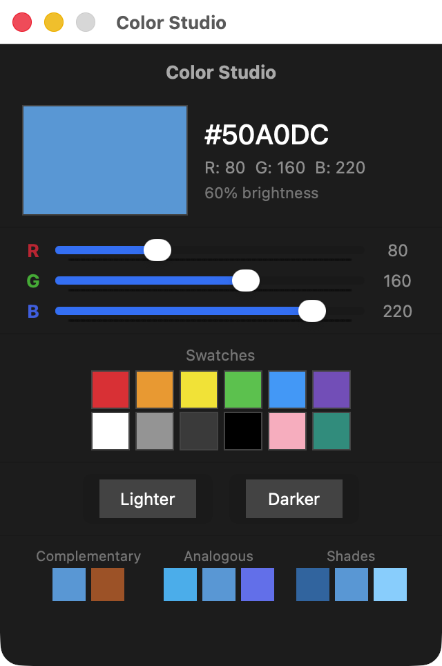
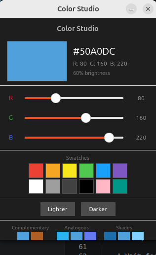
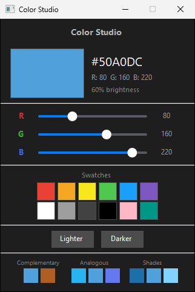
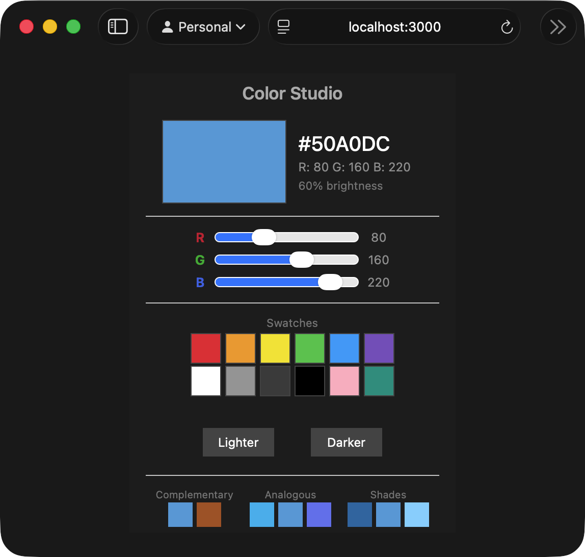
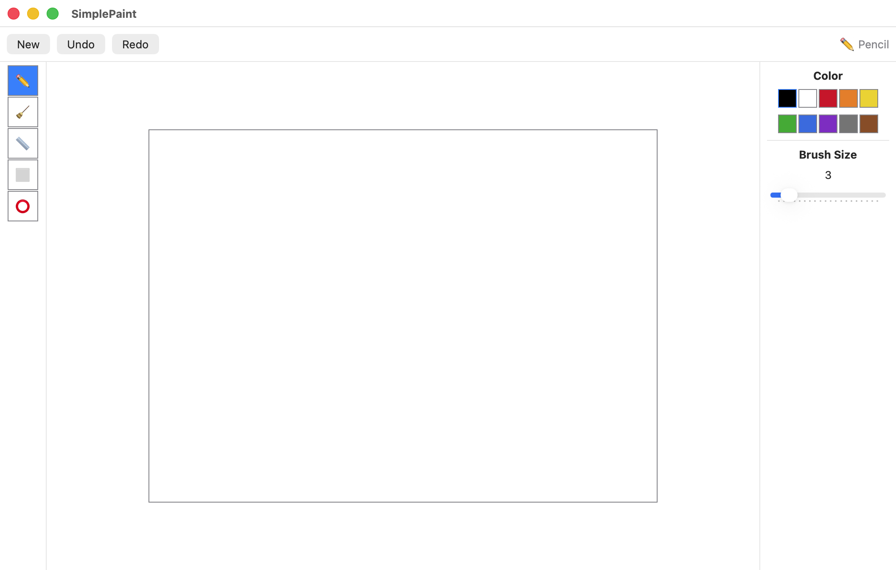
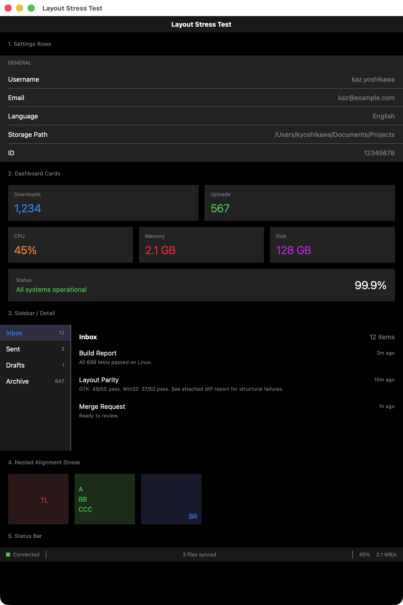
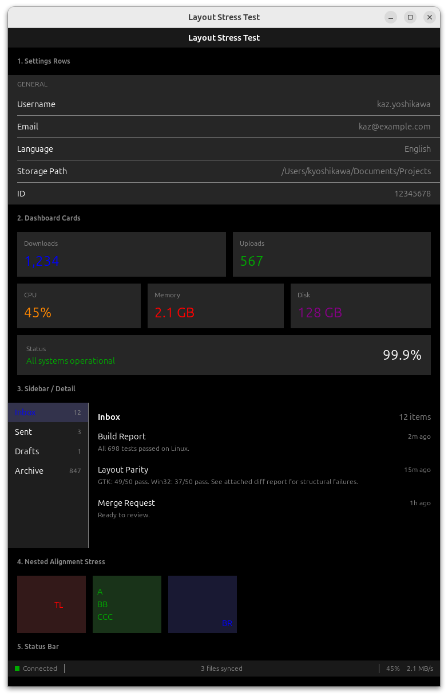
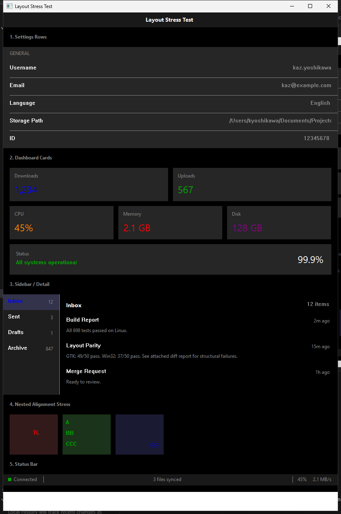

# SwiftOpenUI

Write SwiftUI, run anywhere.

A cross-platform SwiftUI framework that renders natively on macOS, Linux, Windows, and the Web — from a single Swift codebase.

## Color Studio — one codebase, four platforms

| macOS (SwiftUI) | Linux (GTK4) |
|:---:|:---:|
|  |  |
| **Windows (Win32)** | **Web (Wasm)** |
|  |  |

> Same Swift code. Native rendering on each platform. No electron, no webview wrappers.

## SimplePaint — Canvas, Path, and gesture input



A MacPaint-class drawing app with pencil, eraser, line, rectangle, and ellipse tools. Demonstrates Canvas rendering, Path-based drawing, drag gestures, and undo/redo — all from a single `main.swift`.

## Layout Stress Test — advanced composition patterns

| macOS (SwiftUI) | Linux (GTK4) | Windows (Win32) |
|:---:|:---:|:---:|
|  |  |  |

Settings rows, dashboard cards, sidebar/detail split, nested frame alignment, and status bars — the composition patterns real apps use. Layout parity is verified by a [50-scenario test suite](Tests/LayoutParityTests/) that compares each platform's output against macOS SwiftUI reference fixtures.

## Platform Support

| Platform | Backend | Status | Views | Modifiers |
|----------|---------|--------|-------|-----------|
| macOS | SwiftUI (native) | Reference | All | All |
| Linux | GTK4 | Stable | 44/45 | 38/40 |
| Windows | Win32 + D2D | Stable | 43/45 | 38/40 |
| Web | Wasm + DOM | Near-parity | 42/45 | 36/40 |
| Android | Compose | Functional | 27/45 | 23/40 |

## Feature Parity

SwiftOpenUI now tracks parity at two levels:

| Doc | Purpose |
|-----|---------|
| [Feature Parity Matrix](docs/architecture/swiftui-parity-matrix.md) | Backend-by-backend behavior status for SwiftUI features, with notes for GTK4, Win32, Web, and Android |
| [API Implementation Tracker](docs/api/implementation-tracker/README.md) | SwiftUI API-surface coverage, availability, and current vs partial vs missing status by feature family |

Use the matrix when you want to know how a feature behaves on a specific backend. Use the implementation tracker when you want to know whether a SwiftUI view or modifier family exists in SwiftOpenUI at all.

Current examples:
- `.searchable()` is implemented on GTK4, Win32, and Web, with fallback-level placement and lightweight token/suggestion/scope UI documented in the matrix.
- `.safeAreaInset()` and `.safeAreaPadding()` exist on GTK4, Win32, and Web, with synthetic or partial backend behavior documented in the matrix.
- `.toolbar()` and `.sheet()` have working GTK4, Win32, and Web support, while the tracker shows which overload families are implemented vs still pending.

Android support is functional via Jetpack Compose. Core form components, collection views, and precision layout are implemented.

## Quick Start

```bash
# Clone
git clone https://github.com/codelynx/SwiftOpenUI.git
cd SwiftOpenUI

# Run on macOS (uses real SwiftUI)
swift run HelloWorld
swift run ColorMixer

# Run on Linux (GTK4)
sudo apt install libgtk-4-dev
swift run ColorMixer

# Run in browser (Wasm)
./web/run.sh ColorMixer

# Run on Android (Emulator/Device)
./android/renderer/build-so.sh
cd android/renderer/app && ./gradlew installDebug
```

For detailed per-platform setup (prerequisites, toolchains, Vite, GTK4 packages, Visual Studio), see the **[Getting Started Guide](docs/guides/getting-started.md)**.

## App Packaging

Package any executable as a `.app` bundle using the built-in SPM plugin:

```bash
swift package create-bundle HelloWorld --allow-writing-to-package-directory
# Output: .build/bundles/HelloWorld.app
```

Creates a platform-appropriate bundle (macOS: `Contents/MacOS/` + `Info.plist`; Linux: `Info.json` + `lib/`; Windows: `Info.json` + `.exe`). Resources from `Resources/` at the package root are copied automatically.

During development (`swift run`), `AppBundle.main` discovers resources from `Resources/` at the package root without needing a packaged bundle.

See the **[App Bundle Packaging Guide](docs/guides/app-bundle-packaging.md)** for details.

## Examples

### Showcase

Polished mini-apps demonstrating what you can build:

| Example | Command | Description |
|---------|---------|-------------|
| HelloWorld | `swift run HelloWorld` | Minimal app — Text with padding |
| Stopwatch | `swift run Stopwatch` | Timer, start/stop, lap times |
| ColorMixer | `swift run ColorMixer` | Color picker with sliders, swatches, harmony |
| Calculator | `swift run Calculator` | Grid/GridRow calculator with arithmetic logic |
| SimplePaint | `swift run SimplePaint` | Drawing app with tools, color palette, undo/redo |
| LayoutStress | `swift run LayoutStress` | Settings rows, dashboard cards, sidebar/detail, nested alignment, status bar |

### Parity

Matrix-backed coverage screens — one per feature category:

```bash
swift run ParityViewsBasic        # Text, Button, TextField, Color, Spacer, Divider
swift run ParityViewsLayout       # VStack, HStack, ZStack, ForEach, Group
swift run ParityViewsContainers   # Toggle, Slider, Image, ScrollView, List
swift run ParityModifiers         # padding, frame, colors, font, border, opacity
swift run ParityStateData         # @State, @Binding, @ObservedObject, @StateObject
swift run ParityNavigation        # NavigationStack, NavigationLink, NavigationPath
swift run ParityEnvironment       # @Environment, @EnvironmentObject, custom keys
swift run ParityGestures          # onTapGesture, onLongPressGesture, onDrag
swift run ParityAnimation         # .animation(), withAnimation()
swift run ParityFocus             # @FocusState, .focused()
swift run ParityAppStructure      # App, Scene, WindowGroup, @ViewBuilder
```

## What's Implemented

### Views (44 of 45)
Text, Button, TextField, Toggle, Slider, Image, Color, Spacer, Divider, VStack, HStack, ZStack, Group, ForEach, List, ScrollView, ScrollViewReader, AnyView, EmptyView, NavigationStack, NavigationLink, NavigationSplitView, SecureField, TextEditor, ProgressView, Stepper, Label, Link, TabView, Grid, GridRow, DisclosureGroup, OutlineGroup, Form, Section, LazyVStack, LazyHStack, LazyVGrid, LazyHGrid, Picker, DatePicker, GeometryReader, ViewThatFits, Menu, ConfirmationDialog, Canvas, Path, Circle, Rectangle, RoundedRectangle, Capsule, Ellipse, LinearGradient, RadialGradient

### Modifiers (43+)
.padding(), .frame(), .foregroundColor(), .foregroundStyle(), .background(), .font(), .border(), .opacity(), .offset(), .scaleEffect(), .animation(), .imageScale(), .onTapGesture(), .onLongPressGesture(), .onDrag(), .disabled(), .environmentObject(), .environment(), .navigationTitle(), .navigationDestination(), .focused(), .modifier(), withAnimation(), .clipShape(), .clipped(), .hidden(), .blur(), .cornerRadius(), .shadow(), .rotationEffect(), .overlay(), .sheet(), .alert(), .confirmationDialog(), .onAppear(), .onDisappear(), .searchable(), .toolbar(), .gridCellColumns(), .buttonStyle(), .toggleStyle(), .textFieldStyle(), .onChange(), .contextMenu(), .position(), .layoutPriority(), .fixedSize(), .popover(), .id(), .tag(), .onSubmit(), .bold(), .italic(), .fontWeight(), .underline(), .strikethrough(), .textCase(), .aspectRatio(), .scaledToFit(), .scaledToFill(), .fullScreenCover(), .pickerStyle(), .navigationSplitViewColumnWidth(), .ignoresSafeArea(), .safeAreaInset(), .lineLimit(), .truncationMode(), .lineSpacing(), .multilineTextAlignment(), .keyboardShortcut(), .focusedValue(), .help(), .resizable(), .labelsHidden()

### Scenes & App Structure
WindowGroup, Window (GTK/Win32), OpenWindowAction, Commands (CommandGroup, CommandMenuItem — native menu bar on GTK/Win32), @SceneBuilder, @ViewBuilder

### State Management
@State, @Binding, @Bindable, @ObservedObject, @StateObject, @EnvironmentObject, @Published, @Environment, @FocusState, @FocusedValue (active-window scoped), @Observable, ObservableObject

## Architecture

```
+-----------------------------------------------------+
|  Examples (import SwiftUI on macOS, SwiftOpenUI else)|
+-----------------------------------------------------+
|  SwiftOpenUI Core                                    |
|  View, State, Layout, Modifiers, Environment         |
+--------------+---------------+---------------+-------------+
|  BackendGTK4 |  BackendWin32 |  BackendWeb   | BackendDroid|
|  GTKRenderer |  WinRenderer  |  WebRenderer  | AndroidRend.|
|  GTKViewHost |  Win32ViewHost|  WebViewHost  | AndroidHost |
+--------------+---------------+---------------+-------------+
|  CGTK        |  CWin32       |  JavaScriptKit|  JNI        |
|  CGTKBridge  |  CWin32Bridge |  (DOM API)    |  Compose    |
+--------------+---------------+---------------+-------------+
```

The core library (`Sources/SwiftOpenUI/`) is platform-independent with zero platform imports. All GTK/Win32/Web code lives in `Sources/Backend/`. Backends implement rendering via protocol extensions (`GTKRenderable`, `WinRenderable`, `WebRenderable`).

## Building

| Platform | Prerequisites | Build | Test |
|----------|--------------|-------|------|
| macOS | Xcode CLI tools | `swift build` | `swift test` |
| Linux | `libgtk-4-dev` | `swift build` | `swift test` |
| Windows | Swift toolchain | `swift build` | `swift test` |
| Web | [swiftly](https://github.com/swiftlang/swiftly) + Wasm SDK | `./web/run.sh HelloWorld` | N/A |

### Xcode

```bash
brew install xcodegen
cd apple/Examples && xcodegen generate
open Examples.xcodeproj
```

## Documentation

| Doc | Description |
|-----|-------------|
| [Feature Parity Matrix](docs/architecture/swiftui-parity-matrix.md) | Per-backend implementation status |
| [API Implementation Tracker](docs/api/implementation-tracker/README.md) | SwiftUI API-surface coverage and generated feature-family status |
| [Running Examples](docs/guides/running-examples.md) | Build and run on all platforms |
| [Adding a Backend](docs/guides/adding-a-backend.md) | How to implement a new backend |
| [Web Setup](docs/guides/web-setup.md) | Wasm build, Vite, DOM mapping |
| [App Bundle Format](docs/architecture/app-bundle-format.md) | Cross-platform .app bundle spec |
| [App Bundle Packaging](docs/guides/app-bundle-packaging.md) | Packaging guide + SPM plugin |
| [Platform Notes](docs/porting/platform-notes.md) | Platform quirks and workarounds |
| [Web Parity Plan](docs/plans/web-parity-plan.md) | Web backend gap analysis |

## Contributing

1. Pick a view or modifier from the [parity matrix](docs/architecture/swiftui-parity-matrix.md)
2. Add the core definition in `Sources/SwiftOpenUI/Views/` or `Modifiers/`
3. Add backend rendering in each renderer (see [adding a backend](docs/guides/adding-a-backend.md))
4. Add tests in `Tests/SwiftOpenUITests/`
5. Add coverage to the appropriate parity example

## License

MIT License. See [LICENSE](LICENSE) for details.
